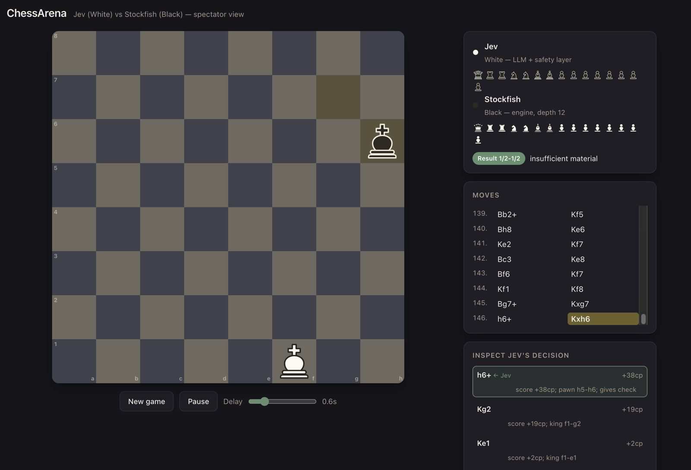
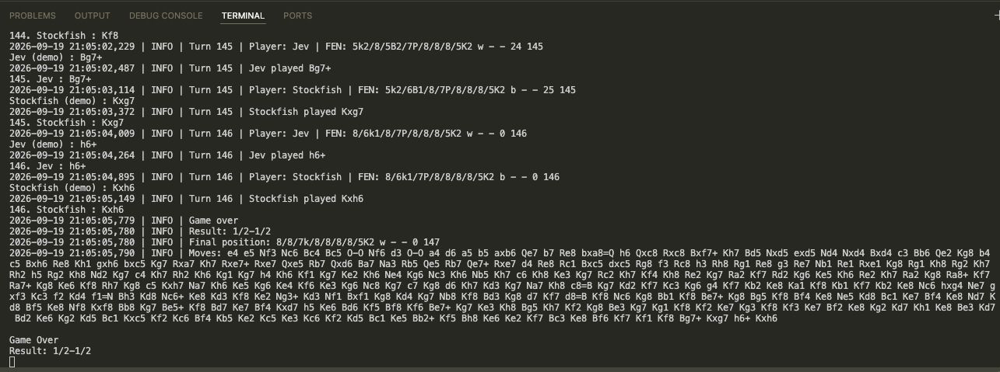

# ChessArena

An experiment: can a language model ("Jev", through the TypeSafe SDK) play chess against Stockfish?

Jev plays White. Stockfish plays Black. The key idea is that **Jev makes the actual decision**. Our own code never picks Jev's move. It only makes sure Jev is shown a small set of legal, tactically sensible options, each described in plain English, and then Jev chooses one.

You can watch a game in the terminal or in a browser with an animated board.

---

## Quick start

### 1. Requirements

- Python 3.10 or newer
- [Stockfish](https://stockfishchess.org/download/) installed on your machine
- A TypeSafe API key (not needed for demo mode)

### 2. Install

```bash
git clone <your-repo-url> ChessArena
cd ChessArena

python -m venv .venv
source .venv/bin/activate        # Windows: .venv\Scripts\activate
pip install -r requirements.txt
```

### 3. Configure

Create a file named `.env` in the project root:

```
TYPESAFE_API_KEY=your-key-here
```

Tell the project where Stockfish lives by editing `STOCKFISH_PATH` at the top of `main.py`. The default is the Homebrew location on Apple Silicon Macs:

```python
STOCKFISH_PATH = "/opt/homebrew/bin/stockfish"
```

To find yours, run `which stockfish` (macOS/Linux) or `where stockfish` (Windows). On macOS, `brew install stockfish` installs it.

### 4. Run

```bash
python main.py                   # play in the terminal
python main.py --ui              # play, and watch in the browser
python main.py --ui --demo       # browser UI with fake players (no key, no Stockfish)
```

Start with `--ui --demo` to check everything works. It plays a scripted opening that includes castling, en passant and a promotion, so you can see all the animations.

Useful flags:

| Flag | What it does |
|---|---|
| `--ui` | Serve the spectator page and open it in your browser |
| `--demo` | Replace both players with stubs |
| `--port 9000` | Use a different port (default 8765) |
| `--no-browser` | Start the server without opening a browser tab |
| `--delay 1.5` | Pause between moves, in seconds (0 to 5) |

Press `Ctrl+C` in the terminal to stop.

### 5. Run the tests

The tests need no API key and no Stockfish. Run them from the project root:

```bash
python -m unittest discover -s tests -v
```

---

## How it works

Each turn, a position goes through a short pipeline before Jev sees it:

```
   chess.Board
        │
        ▼
 CandidateGenerator     ranks every legal move with cheap heuristics
        │               (checks, captures, development, castling, no shuffling)
        ▼
  TacticalFilter        searches a few moves ahead on a COPY of the board;
        │               drops moves that allow mate or lose material, and
        │               scores the rest
        ▼
   move_notes           writes a plain-English note for each surviving move
        │               ("defends the e4 pawn", "leaves the knight undefended")
        ▼
     JevPlayer          shows Jev up to 6 moves plus the notes; Jev picks one
        │
        ▼
    ChessGame           checks the move is legal and plays it
        │
        ▼
  StockfishPlayer       replies (depth 12), and the loop repeats
```

A few rules the design sticks to:

- **Stockfish never helps Jev.** It is only the opponent.
- **The real board is never touched by the candidate layer.** Everything is analysed on copies.
- **Jev is never shown an empty list.** If every move looks bad, it gets the least bad ones.
- **The search is shallow on purpose.** It stops obvious blunders (walking into mate, hanging a piece). It does not plan. Planning is Jev's job.

### What each file does

```
ChessArena/
├── main.py                 entry point; parses flags, builds the players
├── chess_game.py           the game loop: whose turn, validate, apply, publish events
├── jev_player.py           the LLM player: builds the candidates, asks Jev, checks the answer
├── stockfish_player.py     the opponent, a thin wrapper around the Stockfish engine
├── candidate_generator.py  cheap heuristic ranking of all legal moves
├── tactical_filter.py      the shallow search that removes blunders and scores moves
├── move_notes.py           plain-English descriptions of each candidate move
├── move_animation.py       turns a move into piece movements for the UI
├── ui_server.py            small local web server that streams the game to the browser
├── ui/index.html           the board page: one file, no external assets
├── demo_players.py         fake players for --demo
├── logging_config.py       writes logs to the terminal and to logs/game.log
├── requirements.txt
└── tests/                  offline tests (no key, no engine)
```

### The browser UI

`python main.py --ui` starts the game in a background thread and a tiny web server on `http://127.0.0.1:8765`. The page draws the board, animates each move (including castling, en passant and promotion), and has a panel showing what Jev was offered on its last turn: which moves it saw, their scores, which moves the filter removed and why, and which one Jev chose. It also has Pause, New game and speed controls.

You can refresh the page or open a second tab at any time and it catches up to the current game.

---

## Settings you might want to change

**Jev** (in `jev_player.py`, the `JevPlayer` constructor):

| Setting | Default | Meaning |
|---|---|---|
| `max_offered` | 6 | How many moves Jev sees each turn |
| `search_depth` | 6 | How many half-moves the tactical search may look ahead |
| `time_budget` | 4.0 | Seconds the search may spend per turn |
| `material_margin` | 60 | A move scoring this many hundredths of a pawn worse than the best is removed |

**Stockfish** (in `stockfish_player.py`): `depth=12`. Lower it to make the opponent weaker.

---

## Logs and troubleshooting

Every game is appended to `logs/game.log`. Each Jev turn records the position, every move's tactical score and whether it was kept or removed, what Jev was offered, and what it chose.

| Problem | Likely cause |
|---|---|
| `KeyError: 'TYPESAFE_API_KEY'` | The `.env` file is missing or in the wrong folder. It must sit next to `main.py` |
| `FileNotFoundError` for Stockfish | `STOCKFISH_PATH` in `main.py` is wrong. Check it with `which stockfish` |
| Browser shows nothing | Check that the terminal shows the "ChessArena UI on ..." line; try `--port 9000` |
| `Ran 0 tests` | Run from the project root; the test files must be in `tests/` and start with `test_` |

---

## Known limits

- Jev always plays White and Stockfish always plays Black.
- One game runs at a time.
- Games are capped at 200 moves so a shuffling game cannot run forever.
- The tactical search catches short tactics. Losses caused by poor long-term planning are Jev's own, and that is what the experiment is meant to measure.




